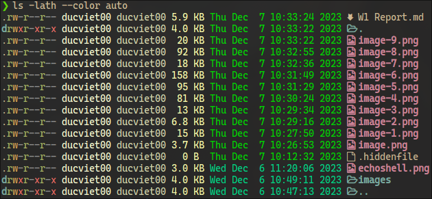
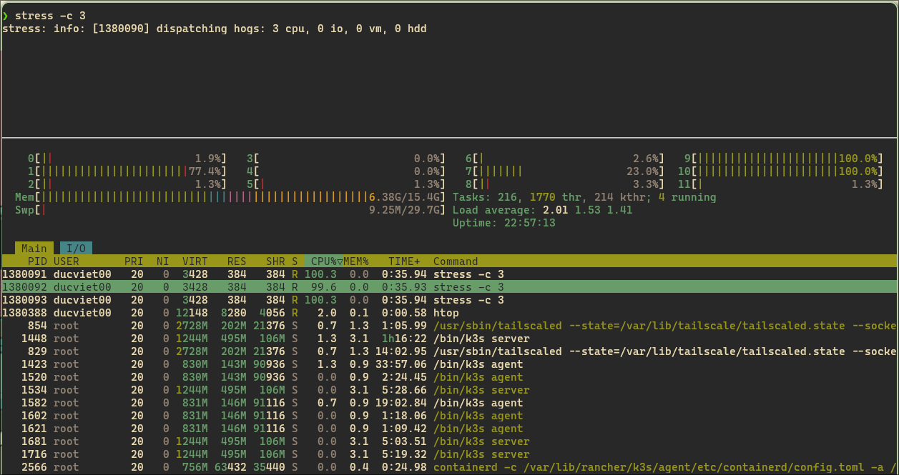

# Precourse #1 Report

## Course Information
- **Course Name:** The Missing Semester of Your CS Education
- **Date:** 2023-12-10
- **Trainee:** Duc-Viet Hoang

-- Thiss shousld be checcked

## Overview

## Course overview + the shell

### Exercise 1:
I mainly use ZSH as my Unix Shell because it has better history, improved tab completion, autosuggestion, globbing, and numerous plugins.


### Exercise 2:
```
$ mkdir /tmp/missing
```

### Exercise 3:
```
$ man touch
```

The primary purpose of the touch command is to create empty files, but it's also used to update the access and modification timestamps of existing files.
Some useful options:
   - `-c, --no-create`: Do not create new files.
   - `-a`: Change only the access time.
   - `-m`: Change only the modification time.
   - `-t`: Use a specified time stamp instead of the current time.

Examples:
- Create a New Empty File: `touch new_file.txt`
- Update Timestamp of an Existing File: `touch existing_file.txt`
- Updating only Access Time: `touch -a echoshell.png`
- Updating only Modification Time: `touch -m echoshell.png`

### Exercise 4:
```
$ touch /tmp/missing/semester
```

### Exercise 5:
In Bash, both double quotes (`"`) and single quotes (`'`) are used for quoting strings, but they have different behaviors:
  - Double Quotes (`"`) allows variable expansion (`name=Viet && echo "Hello, $name."`), command substitution (`echo "Today is $(date)."`) and Recognizes and interprets escape characters within the quotes (`echo "Hey,\nThis is a newline."`)
  - Single Quotes (`'`): Treats everything enclosed within single quotes as literal characters.
  -
Exclamation mark `!` is used as a history expansion character. To treat exclamation mark as literal character, we use single quote (`echo ' exclamation mark!'`) or precede it with a backslash (`echo " exclamation mark\!"`)

```
$ echo '#!/bin/sh' > /tmp/missing/semester
$ echo 'curl --head --silent https://missing.csail.mit.edu' >> /tmp/missing/semester
$ cat /tmp/missing/semester
#!/bin/sh
curl --head --silent https://missing.csail.mit.edu
```


### Exercise 6:


Using `ls` with `-l` option will show the permission and owner of the file.


`/tmp/missing/semester` do not have "execute" permission.

### Exercise 7:
Using `sh` to execute a file, such as `sh semester`, functions successfully even if the file itself, `./semester`, lacks execute permission. This is because `sh` is explicitly invoked to interpret the script, and it operates independently of the execute permission of `./semester`. When using `sh` to execute the file, you are essentially informing the shell that you are executing the `sh` interpreter with `./semester` as an argument, as opposed to directly executing `./semester`.


### Exercise 8:
```
$ man chmod
```

`chmod` is a command in Unix and Unix-like operating systems (including Linux) that is used to change the permissions of a file or directory. The name "`chmod`" stands for "change mode," and it allows you to modify the read, write, and execute permissions for the owner, group, and others.

The basic syntax of the chmod command is as follows:
```
$ chmod "options" "permissions" "file"
```

Here, "options" are additional settings, "permissions" represent the new permissions you want to set, and "file" is the name of the file or directory for which you want to change permissions.

A common useful option is `-R, --recursive` which can change mode for all files in the same directory.

The "permissions" parameter is usually expressed as a three-digit octal number, where each digit corresponds to the permission set for the owner, group, and others, respectively. The permission values are:
  - 4 (100): read (r--)
  - 2 (010): write (-w-)
  - 1 (001): execute (--x)

You can combine these values to specify multiple permissions. For example:
  - 7 (111): read, write, and execute (rwx)
  - 6 (110): read and write (rw-)
  - 5 (101): read and execute (r-x)

### Exercise 9:

```
$ chmod +x /tmp/missing/semester
```


The `#!/bin/sh` is called a shebang or hashbang. The purpose of the shebang is to specify the path to the interpreter that should be used to execute the script. It's can be vary depend on the scripting languauge or interpreter. For example: `#!/usr/bin/python3`


### Exercise 10:
```
$ /tmp/missing/semester | grep last-modified | sed 's/last-modified: //1' > /tmp/missing/last-modified.txt
```


Here:
- `grep last-modified`: This part of the command uses grep to filter the lines containing "last-modified" from the HTTP response headers. It searches for lines that contain the string "last-modified."
- `sed 's/last-modified: //1'`: This part uses sed (stream editor) to replace the "last-modified: " string with an empty string. It effectively extracts the value following "last-modified." The 1 after the substitution command means to perform the substitution only on the first occurrence in each line.

### Exercise 11:
This command reads the current battery capacity percentage from the `/sys/class/power_supply/BAT0/capacity` file.
```
$ cat /sys/class/power_supply/BAT0/capacity
```

## Shell Tools and Scripting

### Exercise 1:



Here,
  - `-a` shows all files, including hidden files
  - `-h` shows sizes are listed in human readable format (e.g. 454M instead of 454279954)
  - `-t` show files are ordered by recency
  - `--color auto` Output is colorized

### Exercise 2:
`marco.sh`:
```bash
#!/bin/bash
marco () {
    LAST_MARCO_DIR=$(pwd)
}

polo () {
    cd $LAST_MARCO_DIR
}
```


### Exercise 3:

```bash
#!/bin/bash

# Output and error log files
output_log="output.log"
error_log="error.log"

# Cleanup logs from previous runs
rm "$output_log" "$error_log"
# Counter for the number of runs
run_count=0

# Run the script until it fails
while true; do
    # Run the provided script and capture output and errors
    ./exercise3.sh >> "$output_log" 2>> "$error_log"

    # Check the exit status of the script
    if [ $? -ne 0 ]; then
        echo "Script failed on run $((++run_count))"
        break
    fi

    # Increment the run count
    ((run_count++))
done

# Print the captured output and errors
echo -e "\n===== Captured Output ====="
cat "$output_log"

echo -e "\n===== Captured Errors ====="
cat "$error_log"

# Print the total number of runs
echo "Total runs: $run_count"
```


### Exercise 4:
This command finds all files with a '.html' extension in the current directory and its subdirectories, then archives them into a compressed tarball named 'zipper.tar.gz'. The use of xargs -d '\n' ensures that filenames with spaces or special characters are handled correctly during the tar operation.

```
find . -name '*.html' | xargs -d '\n' tar -czvf zipper.tar.gz
```


### Exercise 5:

```bash
find /path/to/directory -type f -exec stat --format '%Y :%y %n' "{}" \; | sort -nr | cut -d: -f2- | head

```

Replace `/path/to/directory` with the actual path of the directory

Explanation of the command:

- `find /path/to/directory -type f`: Finds only files (not directories) in the specified directory and its subdirectories.

- `stat --format '%Y :%y %n' "{}"`: Executes the `stat` command for each found file, displaying detailed information including raw modification time, human-readable modification time and filename.

- `sort -nr`: Sorts the output. The `-nr` options ensure a reverse (descending) numerical sort, so the most recently modified files appear first.

- `cut -d: -f2-`: This command cuts each line using a colon (-d:) as the delimiter and selects fields 2 through the end (-f2-). It essentially removes the raw modification time, leaving only the human-readable modification time and the filename.


## Course overview + the shell

# Exercise 1:


# Exercise 2:
```bash
pidwait() {
    local pid=$1
    local wait_interval=5  # Adjust this value based on your preferences

    # Check if the process exists
    if kill -0 "$pid" 2>/dev/null; then
        echo "Waiting for process with PID $pid to complete..."
        while kill -0 "$pid" 2>/dev/null; do
            sleep "$wait_interval"
        done
        echo "Process with PID $pid has completed."
    else
        echo "Process with PID $pid does not exist."
    fi
}
```


# Exercise 3:

# Exercise 4:


# Exercise 5:

Run `history | awk '{$1="";print substr($0,2)}' | sort | uniq -c | sort -n | tail -n 10` to get your top 10 most used commands and consider writing shorter aliases for them. Note: this works for Bash; if you’re using ZSH, use history 1 instead of just history.


---

# Exercise 6: Dotfiles

  1. Create a folder for your dotfiles and set up version control.
  2. Add a configuration for at least one program, e.g. your shell, with some customization (to start off, it can be something as simple as customizing your shell prompt by setting $PS1).
  3. Set up a method to install your dotfiles quickly (and without manual effort) on a new machine. This can be as simple as a shell script that calls ln -s for each file, or you could use a specialized utility.
  4. Test your installation script on a fresh virtual machine.
  5. Migrate all of your current tool configurations to your dotfiles repository.
  6. Publish your dotfiles on GitHub.

---

Check out my dotfiles at: https://github.com/ducviet00/dotfiles

# Exercise 7:

Go to `~/.ssh/` and check if you have a pair of SSH keys there. If not, generate them with `ssh-keygen -o -a 100 -t ed25519`. It is recommended that you use a password and use `ssh-agent`.

---


# Exercise 8:

Edit .ssh/config to have an entry as follows
```
 Host vm
     User username_goes_here
     HostName ip_goes_here
     IdentityFile ~/.ssh/id_ed25519
     LocalForward 9999 localhost:8888
```

---


# Exercise 9:

Use ssh-copy-id vm to copy your ssh key to the server.

---


# Exercise 10:

Start a webserver in your VM by executing `python -m http.server 8888`. Access the VM webserver by navigating to `http://localhost:9999` in your machine.

```
ssh ducviet00-arch "python -m http.server 8888"
```

or


# Exercise 11:

Edit your SSH server config by doing sudo vim /etc/ssh/sshd_config and disable password authentication by editing the value of PasswordAuthentication. Disable root login by editing the value of PermitRootLogin. Restart the ssh service with sudo service sshd restart. Try sshing in again.

---
Using vim to edit sshd_config with root permission:
```
sudo vim /etc/ssh/sshd_config
```

Set the following values:

```
PasswordAuthentication no
PermitRootLogin no
```

Restart the ssh service:

```
sudo service ssh restart
```

Try sshing again:

```
ssh ducviet00-arch
```

# Exercise 12:
Install mosh in the VM and establish a connection. Then disconnect the network adapter of the server/VM. Can mosh properly recover from it?

---

# Exercise 13:

Use the `-N` and `-f` flags to establish background port forwarding:

```
-N      Do not execute a remote command.
-f      Requests ssh to go to background just before command execution.
```

```bash
ssh -N -f -L 9999:localhost:8888 vm
```


This command forwards traffic from port 8888 on the VM to port 9999 on the local machine in the background.


# Exercise 14:

```
stress -c 3
```

This command runs the `stress` tool with the CPU stress test, requesting three workers. The CPU consumption can be monitored using `htop` or any other system monitoring tool (e.g `btop` - better alternative to htop).




```
taskset --cpu-list 0,2 stress -c 3
```

This command uses taskset to execute stress and binds it to CPUs 0 and 2 only. The stress command will be limited to using only these specified CPUs.


The command `stress -m 1 --vm-bytes 2G` is using the stress tool to simulate memory-intensive tasks. Let's break down the components of this command:

  - `-m 1` or `--vm 1`: This option specifies the number of workers which are spawned to spin on malloc()/free()

  - `--vm-bytes 2G`: This option sets the amount of B bytes which be malloced per vm worker

```
stress -m 1 --vm-bytes 2G
```

This hereinbelow image shows that the `stress` program with `PID 1422277` using `1.5G` memory. The system monitoring is `btop`.


Create a control group (cgroup) named "moreh_memory_limit" using cgcreate:
```
sudo cgcreate -g memory,cpuset:moreh_memory_limit
```

Set a memory limit for the cgroup using cgset:

```
sudo cgset -r memory.max=100M moreh_memory_limit
```
Note that, in cgroups v2, the memory limit changed from `/sys/fs/cgroup/memory/memory.limit_in_bytes` to `/sys/fs/cgroup/memory.max`
https://github.com/dask/distributed/issues/6894

```
sudo cgexec -g memory,cpuset:moreh_memory_limit stress -m 1 --vm-bytes 2G
```

This hereinbelow image shows that the `stress` program with `PID 1444363` **only using `96M` memory (`<100M` according the max memory setted in cgroup)**.


Set the cpu ids for the cgroup using cgset:

```
sudo cgset -r cpuset.cpus=0,2 moreh_memory_limit
```

This hereinbelow image shows that there are 4 `stress` programs with PID `1446834`,`1446835`,`1446836`,`1446837` **only using 2 CPU with ids same cpuset.cpus and the total amount of ram is smaller than memory.max which be setted in cgroup**.

```
sudo cgexec -g memory,cpuset:moreh_memory_limit stress -m 4 --vm-bytes 2G
```


